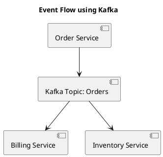

# 🧠 GitHub Copilot Instructions for Architecture Documentation

This guide helps developers use GitHub Copilot inside **VS Code** to generate:

- ✅ Architecture Decision Records (ADRs)
- 📐 Architecture Diagrams using PlantUML

---

## ✅ 1. Writing Architecture Decision Records (ADRs)

### 📁 File Path Convention

Create files under `docs/adr/` in this format:

```
docs/adr/0001-title-of-decision.md
```

### ✨ Copilot Prompts for ADRs

Type this heading and press `Enter` to let Copilot continue:

```markdown
# Use Redis for Caching

## Status
Proposed

## Context
```

> 💬 Prompt ideas:
> - "We need to reduce database load for session and catalog data"
> - "Describe why we're considering Redis over in-memory cache"

Then continue with:

```markdown
## Decision
```

> 💬 Prompt:
> - "We will use Redis as the caching layer because..."

Then:

```markdown
## Consequences
```

> 💬 Prompt:
> - "Benefits of this decision include..."

Finally:

```markdown
## Alternatives Considered
```

> 💬 Prompt:
> - "We evaluated Memcached, but it lacks support for..."

---

## 📐 2. Creating Architecture Diagrams in PlantUML

### 📁 File Path Convention

Place `.puml` files in the `diagrams/` folder.

```
diagrams/cache-flow.puml
```

### ✨ Copilot Prompts for PlantUML

Start typing:


> 💬 Prompt:
> - "Sequence diagram for WebApp accessing Redis, falling back to PostgreSQL"
> - "Component diagram for microservices with API Gateway, AuthService, DB"

Copilot will suggest:

```plantuml
actor User
User --> WebApp : Login request
WebApp --> Redis : Check session
Redis --> PostgreSQL : Cache Miss
PostgreSQL --> Redis : Populate Cache
WebApp --> User : Authenticated
@enduml
```

---

## 💡 Tips

- Use `Ctrl+Enter` or `Cmd+Enter` to accept Copilot’s multi-line suggestions.
- Add a comment like `// use PlantUML for component diagram` to get context-aware completion.
- Type slow and deliberate prompts to improve Copilot relevance.
- Use consistent keywords: `Cache`, `Microservice`, `API Gateway`, `Database`, etc.

---

## 🔧 VS Code Extensions (Recommended)

- [GitHub Copilot](https://marketplace.visualstudio.com/items?itemName=GitHub.copilot)
- [PlantUML](https://marketplace.visualstudio.com/items?itemName=jebbs.plantuml)
- [Markdown All in One](https://marketplace.visualstudio.com/items?itemName=yzhang.markdown-all-in-one)

---

## 📘 Sample Files

| Purpose | File |
|--------|------|
| ADR | `docs/adr/0002-adopt-kafka-for-events.md` |
| Diagram | `diagrams/event-streaming.puml` |

---

## 🧪 Example Prompt: ADR + Diagram

```markdown
# Use Kafka for Event Streaming

## Context
Our current system uses direct HTTP calls between services, causing tight coupling and performance bottlenecks...

## Decision
We will adopt Kafka as the backbone for asynchronous communication...

## Diagram

```

And in `event-streaming.puml`:



---

> For questions, contact the architecture team or refer to `adr/README.md`.
