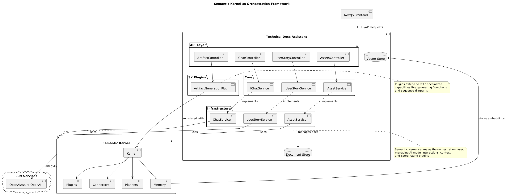

# ADR 0001: Use of Semantic Kernel as Orchestration Framework

## Status

Accepted

## Date

2025-05-08

## Context

The Technical Docs Assistant project requires an efficient way to integrate AI capabilities for various functions including:

- Retrieval Augmented Generation (RAG) for technical documentation
- Generation of technical artifacts (PlantUML diagrams, test cases) from user stories
- Chat interfaces with context management
- Integration with vector stores for efficient document retrieval

We needed a framework that would provide:
1. Flexible orchestration of AI models and components
2. Support for context management in conversations
3. Plugin architecture for extending functionality
4. Integration with vector databases for RAG capabilities
5. Ability to work with structured data (user stories, technical artifacts)
6. Support for both .NET backend and NextJS frontend integration

## Decision

We have decided to use Microsoft's Semantic Kernel as the orchestration framework for this project.

Semantic Kernel provides:

1. **Modular Architecture**: Allows us to create and integrate various plugins (like ArtifactGenerationPlugin) that extend the AI capabilities
2. **Context Management**: Handles conversation history and context for the chat functionality
3. **RAG Support**: Built-in support for vector stores and retrieval augmented generation
4. **Kernel Functions**: Declarative approach to define AI capabilities through annotations
5. **Prompt Engineering**: Advanced prompt templating and management
6. **Memory & Embeddings**: Integrated vector storage for embedding-based retrieval
7. **Cross-Platform Support**: Works with our .NET backend while supporting integration with our NextJS frontend
8. **Active Development**: Maintained by Microsoft with regular updates and improvements

## Diagram

The diagram above illustrates how Semantic Kernel serves as the central orchestration layer in our architecture:
- It connects our application components to LLM services
- Manages memory and embeddings for RAG functionality
- Enables plugin architecture for extending AI capabilities
- Provides consistent interfaces for various services to interact with AI

## Consequences

### Positive

- **Simplified AI Integration**: Semantic Kernel handles the complexity of connecting to AI models and managing responses
- **Extensibility**: New plugins can be added as the system evolves (e.g., more artifact types)
- **Maintainability**: Standard patterns for AI integration make code more maintainable
- **Performance**: Efficient handling of embeddings and vector operations for RAG
- **Developer Productivity**: Reduces boilerplate code for AI integration
- **Integrated Prompt Management**: Better organization of prompts used for artifact generation

### Negative

- **Learning Curve**: Team members need to understand Semantic Kernel concepts
- **Dependency on External Framework**: We're tied to Semantic Kernel's development roadmap
- **Potential Over-abstraction**: For simpler use cases, might introduce unnecessary complexity
- **Versioning Challenges**: As Semantic Kernel evolves rapidly, we may face breaking changes

### Monitoring & Review Points

We will evaluate this decision after:
- Completing the initial RAG implementation
- Implementing the first set of artifact generation features
- Performance testing with large document corpora
- User feedback on the first iteration

## Alternatives Considered

1. **Direct LLM Integration**: Using the OpenAI SDK directly without an orchestration layer
   - Rejected due to lack of built-in context management and more complex implementation for RAG
   
2. **LangChain.NET**: Alternative orchestration framework
   - Rejected due to less mature .NET support and fewer enterprise deployments
   
3. **Custom Orchestration Layer**: Building our own lightweight orchestration
   - Rejected due to development time requirements and maintenance burden

## References

- [Semantic Kernel GitHub Repository](https://github.com/microsoft/semantic-kernel)
- [Semantic Kernel Documentation](https://learn.microsoft.com/en-us/semantic-kernel/overview/)
- [RAG Pattern Documentation](https://learn.microsoft.com/en-us/azure/architecture/patterns/rag)