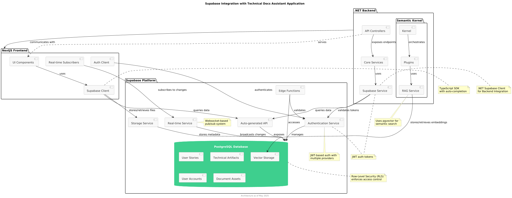

# ADR 0002: Use of Supabase as Backend as a Service

## Status

Accepted

## Date

2025-05-08

## Context

The Technical Docs Assistant project requires a robust backend solution that provides:

- Secure user authentication and authorization
- Database services for storing user stories, technical artifacts, and metadata
- Storage capabilities for documents and generated artifacts
- Real-time data synchronization between users
- Support for structured migrations as the application evolves
- API endpoints that integrate well with both our .NET backend and NextJS frontend

We needed a solution that would:
1. Minimize backend infrastructure management and maintenance
2. Provide robust PostgreSQL database capabilities
3. Support real-time data access patterns for collaborative features
4. Offer strong security and authentication features
5. Allow for both cloud hosting and potential self-hosting if needed
6. Integrate well with our existing technology stack
7. Support structured database migrations
8. Scale effectively as the application grows

## Decision

We have decided to use Supabase as our Backend as a Service (BaaS) solution for this project.

Supabase provides:

1. **PostgreSQL Database**: Enterprise-grade relational database with ACID compliance, triggers, and functions
2. **Authentication Services**: Built-in user management, JWT tokens, and support for multiple auth providers
3. **Storage Solutions**: Managed file storage for documentation artifacts and generated content
4. **Real-time Capabilities**: Built-in publish/subscribe functionality for real-time collaboration features
5. **Auto-generated APIs**: REST and GraphQL endpoints created automatically from database schema
6. **Row-Level Security (RLS)**: Fine-grained access control at the database level
7. **Database Migrations**: Structured approach to schema evolution
8. **Edge Functions**: Serverless functions for custom backend logic
9. **TypeScript Support**: First-class TypeScript support for our NextJS frontend
10. **Open Source Core**: Based on open-source technologies with option for self-hosting
11. **Active Development**: Strong community support and regular feature updates

## Diagram

The diagram above illustrates how Supabase integrates with our Technical Docs Assistant application:
- PostgreSQL database stores our user stories, technical artifacts, user accounts, and vector data for RAG
- Authentication service handles user identity and security
- Storage service manages document assets and generated artifacts
- Real-time service enables collaborative features through websocket connections
- Edge Functions provide serverless capabilities for specific backend operations
- Row-Level Security (RLS) enforces access control at the database level
- JWT tokens secure communication between components

The diagram shows how both our NextJS frontend and .NET backend interact with Supabase services, as well as how Semantic Kernel leverages Supabase for RAG functionality via vector storage.

## Consequences

### Positive

- **Reduced DevOps Overhead**: Managed services reduce infrastructure management needs
- **Development Speed**: Pre-built authentication, storage, and database services accelerate development
- **Type Safety**: Strong TypeScript integration improves frontend development experience
- **SQL Power**: Full PostgreSQL capabilities versus more limited NoSQL alternatives
- **Cost Efficiency**: Pay-as-you-grow pricing model aligned with project scaling
- **Real-time Capabilities**: Built-in support for collaborative features without additional infrastructure
- **Security**: Row-level security provides robust data protection
- **API Consistency**: Auto-generated APIs maintain consistency between data and access patterns

### Negative

- **Vendor Dependency**: Reliance on Supabase as a service provider
- **Learning Curve**: Team needs to understand Supabase-specific patterns and features
- **Potential Migration Challenges**: If we need to move away from Supabase in the future
- **Limited Customization**: Some advanced database configurations may require workarounds
- **PostgreSQL Limitations**: While powerful, PostgreSQL has different scaling characteristics than some NoSQL options

### Monitoring & Review Points

We will evaluate this decision after:
- Implementation of user authentication system
- First major database migration
- Load testing with typical user patterns
- Completion of real-time collaborative features
- 6 months of production operation

## Alternatives Considered

1. **Firebase**: Google's Backend as a Service
   - Rejected due to NoSQL data model limitations and potential challenges with complex queries needed for our documentation relationships
   
2. **AWS Amplify**: Amazon's full-stack solution
   - Rejected due to more complex configuration and less seamless PostgreSQL integration
   
3. **Custom Backend Infrastructure**: Building our own services on cloud providers
   - Rejected due to increased development and maintenance overhead

4. **MongoDB Atlas**: Managed MongoDB service
   - Rejected due to preference for relational data model for our structured documentation relationships

## Integration with Existing Architecture

Supabase integrates with our architecture as follows:

- **NextJS Frontend**: Direct integration with Supabase client libraries for authentication, data access, and real-time subscriptions
- **.NET Backend**: API services connect to Supabase for data storage and retrieval
- **Semantic Kernel**: Uses Supabase to store embeddings and vector data for the RAG functionality

## References

- [Supabase Documentation](https://supabase.com/docs)
- [Supabase GitHub Repository](https://github.com/supabase/supabase)
- [PostgreSQL Documentation](https://www.postgresql.org/docs/)
- [Supabase Real-time Documentation](https://supabase.com/docs/guides/realtime)
- [Supabase Auth Documentation](https://supabase.com/docs/guides/auth)