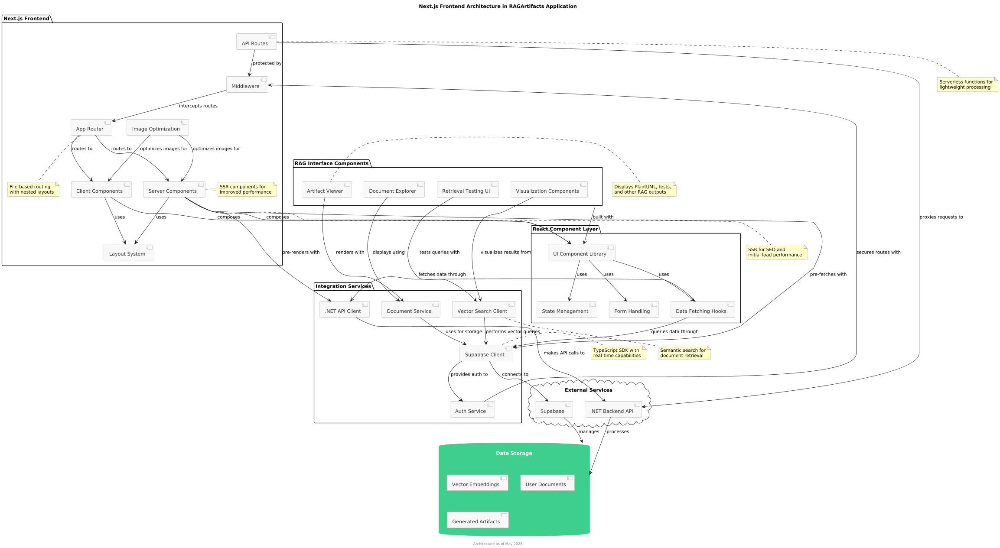

# ADR 0003: Use of Next.js as Frontend Framework

## Status

Accepted

## Date

2025-05-09

## Context

The RAGArtifacts project requires a robust frontend framework that can effectively display and interact with Retrieval Augmented Generation components while providing a smooth user experience. The frontend needs to handle:

- Display of document collections and their embeddings
- Interactive visualizations of retrieval quality and metrics
- Retrieval testing interfaces
- Admin panels for document processing and system configuration
- Authentication and user management
- API integration with our .NET backend

We needed a framework that would provide:
1. Server-side rendering capabilities for better SEO and performance
2. Type safety with TypeScript integration
3. Efficient handling of data fetching and state management
4. Streamlined routing system
5. Modern development experience
6. Compatibility with Supabase for authentication and vector storage
7. Scalability for growing feature set

## Decision

We have decided to use Next.js as the frontend framework for this project.

Next.js provides:

1. **Server-Side Rendering (SSR) and Static Site Generation (SSG)**: Improves initial load performance and SEO for content-heavy pages displaying RAG artifacts and documentation
2. **API Routes**: Built-in serverless functions capability for lightweight backend operations
3. **React Foundation**: Component-based architecture making it easier to build complex UIs with reusable components
4. **File-based Routing**: Intuitive navigation structure that maps directly to file system organization
5. **TypeScript Support**: First-class TypeScript integration for type safety across the application
6. **Image Optimization**: Automatic image optimization for document thumbnails and visualizations
7. **Supabase Integration**: Excellent compatibility with Supabase's JavaScript client libraries for authentication and vector operations
8. **Incremental Static Regeneration**: Ability to update static content without full rebuilds, useful for updating artifact collections
9. **Middleware Support**: For handling authentication flows and request/response modifications
10. **Deployment Options**: Versatile deployment options including Vercel for production environments

## Diagram

The frontend architecture integrates with our existing Supabase backend as illustrated in the architecture diagram:

The diagram illustrates how Next.js serves as the frontend framework in the RAGArtifacts application, highlighting its integration with React components, backend services, and RAG-specific features.

## Consequences

### Positive

- **Improved Performance**: SSR and SSG capabilities provide better initial load times and SEO benefits
- **Developer Experience**: File-based routing and built-in TypeScript support enhance development productivity
- **Scalability**: Application structure can grow efficiently as we add more RAG functionality
- **Seamless API Integration**: API routes simplify backend communication patterns
- **Modern Stack**: Ensures longevity and community support for the project
- **Component Reusability**: React foundation enables consistent UI components across the application
- **Optimized Data Fetching**: Built-in data fetching capabilities reduce client-side overhead

### Negative

- **Learning Curve**: Team members without React/Next.js experience will need time to adapt
- **Build Complexity**: SSR/SSG adds complexity to the build and deployment process
- **JavaScript Ecosystem Pace**: Rapid evolution might require frequent updates to keep current
- **Bundle Size Management**: Requires careful attention to prevent large client bundles
- **Backend/Frontend Context Switching**: Developers working on full-stack features need to switch between .NET and Next.js contexts

### Monitoring & Review Points

We will evaluate this decision after:
- Implementing the document management interface
- Completing the retrieval quality analysis dashboard
- Measuring performance with large document sets
- User feedback on the initial UI/UX
- First production deployment

## Alternatives Considered

1. **React with Create React App (CRA)**: Traditional React SPA approach
   - Rejected due to lack of built-in SSR and more complex API integration
   
2. **Angular**: Alternative frontend framework
   - Rejected due to steeper learning curve and less optimal fit with our Supabase integration
   
3. **Vue.js/Nuxt.js**: Alternative frontend framework with SSR capabilities
   - Rejected due to team familiarity with React ecosystem and stronger TypeScript integration in Next.js
   
4. **Blazor WebAssembly**: Microsoft's .NET-based frontend framework
   - Rejected due to performance concerns with WebAssembly and more limited ecosystem for UI components

## References

- [Next.js Documentation](https://nextjs.org/docs)
- [Supabase with Next.js](https://supabase.com/docs/guides/getting-started/tutorials/with-nextjs)
- [Next.js with TypeScript](https://nextjs.org/docs/basic-features/typescript)
- [Vercel Deployment Documentation](https://vercel.com/docs/concepts/deployments/overview)